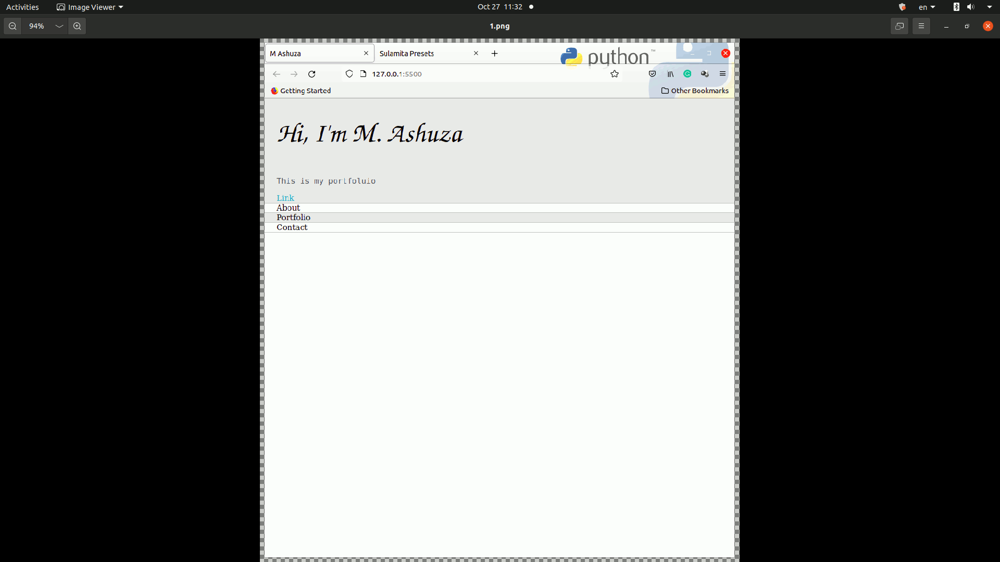

## About The Project

    This is my profetional portfortfolio 

## Technologies Used
* HTML / CSS : For the marckup and style
* Javascript : For the animations

## Project Screen Short

## Referncies 
If you wanna build it on your own, [you can follow this Youtube video](#).

